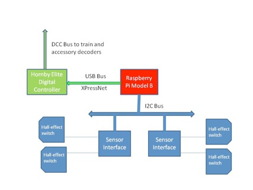

#Overview

<iframe width="560" height="315" src="https://www.youtube.com/embed/VdGRsR1m2Oo" frameborder="0" allowfullscreen></iframe>

This note introduces my experiences of using the Raspberry Pi to automate a model railway.

Two aspects are covered:

- Sending commands to a DCC controller
- Detecting a train’s position



*Schematic showing the Pi's USB and I2C interfaces*

#Sending commands to a DCC controller

The RPi is connected to a Hornby Elite DCC controller by a USB cable. A python program sends XPressNet commands to the controller using the python serial package (python-serial). 

The XPressNet protocol (developed by Lenz) allows DCC control devices such as hand-held controllers to be connected to the command station . Such connections are high-speed RS-485 links. Lenz and probably others make devices that allow PCs to be connected to the XPressNet bus via a slow speed (e.g. 9600 or 19200 Baud) serial connection. The Hornby Elite has this slow speed interface built in allowing it to be  connected directly to a PC’s (or RPi’s) USB port. For further information about XPressNet including the full specification see the [Lenz website](http://www.lenzusa.com/techinfo/index.htm)

I’m only using commands that control the trains throttle, functions (e.g.sound) and accessories (e.g signals). I don’t know how fully the protocol is implemented by the Elite. There appear to be discrepancies between the documented responses and what I get back from Elite after a command has been sent. Currently, I only look for a x’05‘. If I get it, I assume the command has been executed successfully, if I don’t, I resend the command.

One problem I had, was getting Linux to correctly recognise the Elite when it was connected to the RPi. It appears that Hornby incorrectly uses product and device ids in their firmware. This results in the wrong drivers being associated with the Elite. This problem can be resolved by creating a file called : 
```
/etc/udev/rules.d/10-elite.rules
```
containing the following command (all one line):

```
ATTR{idVendor}=="04d8", ATTR{idProduct}=="000a", RUN+="/sbin/modprobe -q ftdi_sio vendor=0x04d8 product=0x000a"
```
You should see a message similar to the following when Linux is restarted:

```
[    7.319030] usb 1-1.3.1: FTDI USB Serial Device converter now attached to ttyUSB1
[    7.356074] usbcore: registered new interface driver ftdi_sio
```
The application program running on the RPi should now be able to communicate with the Elite using the file id ttyUSB1.

Before python can communicate with the serial port you need to install the python serial package e.g. :
```
sudo apt-get install python-serial
```
## Examples
The following snippets are examples or sending commands to the controller from a python program.

To use the python serial interface import the serial package:
```python
import serial
```
The following will open the serial port ttyUSB1 with a speed of 9600 Baud, no parity and one stop bit:
```python
ser = serial.Serial('/dev/ttyUSB1',9600)
```

To send a command, use the write method (‘message‘ could be a string, but I’ve found easier to build a command as a bytearray):
```python
ser.write(message)
```

To close the serial port, call the close method:
```python
ser.close()
```
The following is an example of sending a command and waiting for a response. If a x’05’ is not received, the command will be resent up to a maximum of 5 times:
```python
def send(message):
    ok = False
    trys = 1
    while (not ok and trys < 5) :
        ser.write(message)
        print 'trys = %d send:' % (trys) , 
        for byte in message:print(hex(byte)) ,
        time.sleep(.1)
        print ' receive: ',     
        while ser.inWaiting() > 0 :
            enq = ser.read()
            print enq.encode('hex') ,  
            if enq == '05'.decode('hex') : 
                ok = True
        print 
        trys += 1
```
The XPressNet protocol states that the last byte of a command is a ‘Error detection byte’. It is formed using an X-Or linkage of the proceeding bytes of the command.  The following function will determine the error detection byte:
```python
def parity(message):
    edb = 0
    for byte in message:
        edb ^= byte
    message.append(edb)
```
The following example shows how a function could be coded to implement the XPressNet throttle command:
```python
def setThrottle(address,direction,speed):
    message = bytearray('E400000000'.decode('hex'))
    message[1] = 0x13
    message[3] = address
    message[4] = speed
    if direction  == 'f' : message[4] |= int(b'10000000',2)
    elif direction =='b' : message[4] &= int(b'01111111',2)
    parity(message) 
    send  (message) 
```

#Detecting a train’s position
For railway automation to be effective, some sort of positional feedback is required. There are a number of techniques for achieving this, ranging from sophisticated RFID readers that can read information stored on tags fitted to the train to simple mechanical switches such as reed relays activated by magnets fitted under the train.

The approach adopted with this project, is the use of hall-effect switches fitted to the track and a magnet fitted to the underside of each train. It has the following advantages:

- It is relatively inexpensive, compared with the RFID approach.
- Multiple sensors (a maximum of 128) could be connected to the RPi.
- It is reasonably reliable compared with mechanical switches.
- The sensors can be easily moved around the track when developing a layout.

This approach does, however, lack the ability for a computer to distinguish between different trains. A complex layout with a number of trains concurrently running will struggle to achieve full automation, however, even with a reasonable size layout, it should be possible to manage a degree of automation by building algorithms into the automation program that will deduce which train has triggered the sensor by the sequence of sensors activated. 

The positional feedback system comprises of two components:

- The Hall-effect switch. 
- The Hall-effect switch interface.
##The Hall-effect switch
The hall-effect switch is a small device that fits on the railway track. The A1121LUA -T is just the right size to fit between the sleepers of a Hornby track.


*The hall-effect switch fitted between the sleepers*

The flat side of the device should be facing upwards towards the underside of the train. Care must be taken to ensure the three leads that protrude from the device do not touch each other or the metal rail.

For detailed information of the device see the [device data sheet](http://www.allegromicro.com/en/Products/Magnetic-Digital-Position-Sensor-ICs/Hall-Effect-Unipolar-Switches/~/media/Files/Datasheets/A112x-Datasheet.ashx) and [the applications guide](http://www.google.co.uk/url?sa=t&rct=j&q=hall-effect ic applications guide application note 27701&source=web&cd=1&sqi=2&ved=0CCoQFjAA&url=http://www.allegromicro.com/Design-Center/Technical-Documents/Hall-Effect-Sensor-IC-Publications/~/media/Files/Technical-Documents/AN27701-Hall-Effect-IC-Application-Guide.ashx&ei=L71yUKCqPKTK0QXkxID4Cg&usg=AFQjCNHQaG5n704U0cOaAGd9X0LExH59Cw)

The switch is activated when the south-pole of a magnet passes over the hall-effect device.


*Picture showing a magnet located beneath the train secured with Blutack*

##The Hall-effect switch interface

The output of the switch is capable of directly driving CMOS or TTL logic. In it’s normal state the output is HIGH. When the south-pole of the magnet passes overhead, the output pin is driven LOW.

The Hall-effect switch output is connected to a 16-Bit I/O Expander (MCP23017).


*Circuit diagram of the Hall-effect sensor interface*

For further information regarding the MCP23017 see the [Microchip Data sheet](http://ww1.microchip.com/downloads/en/devicedoc/21952b.pdf)

It is assumed that the automation program will enable the internal pull-up resistors on the inputs to the MCP23017. This eliminates the need for external resistors between input pins and the positive rail (for example pin 21 and +5V).

The MCP23017 has 2 groups of I/O ports:

- GPA0 - GPA7  (pins 21 - 28)
- GPB0 - GPB7 (pins 1 - 8)

The circuit diagram shows only 4 sensors connected GPA0 - GPA3. It is possible to connect a further 4 sensors to GPA4 - GPA7 (pins 24 - 28).

In addition, a further 8 sensors could be connected to GPB0 - GPB7. The circuit diagram shows GPB0 - GPB3 (pins 1 - 4) being used as outputs to drive LEDs used as indicators driven by the automation program. R1 - R4 are resistors of suitable value to act as limiting resistors to protect the LEDs.  The project is currently using 330 ohm resistors.

The circuit diagram also shows an LED connected to the interrupt output for I/O port A. 

The MCP23017 is connected to the RPi via it’s I2C interface.

For further information about I2C, see [the I2C website](http://www.i2c-bus.org/)

The IC2 bus consists of 2 data connections to the RPi

- SCL (pin 12 on the MCP23017) - Serial clock input - driven by the RPi
- SDA (pin 13 on the MCP23017) - Serial data I/O

In the current version of the project the 5V supply of the RPi is used to power the sensor interface and the sensors. Care must be taken that this supply is not over-loaded. If the 5V supply of the RPi drops to below 4.9V it is advisable to use an independent power supply for the interface and sensors.

The interface is connected to the RPI through its GPIO port, 26 pin male plug fitted on the edge of the RPi. Refer to RPi documentation for the correct pin layout of this plug.

- pin 2 - +5V
- pin 3 - I2C SDA
- pin 5 - I2C SCL
- pin 6 - Ground

Up to 8 MCP23017 devices could be connected to the RPi’s I2C bus. The address of each device is determined by the 3 address select pins (pins 15, 16, and 17). In the current project only one device is on the bus, so all address pins are taken to LOW.   

You will need to enable I2C on the RPi. SK Pang Electronics have  a very good step by step [guide to I2C installation](http://www.skpang.co.uk/blog/archives/575)

##Examples

The following snippets are examples of managing the sensor interface from a python program.

To start using the I2c interface you must import smbus:
```python
import smbus
```

Instantiate an instance of smbus:
```python
bus = smbus.SMBus(0)
```

Define the address of the I/O expander. If all 3 address pins are LOW then the device address is 0x20"
```python
address = 0x20 # I2C address of MCP23017
```

Define constants for the registers in the MCP23017. For information about the registers and their purpose see the [Microchip Data sheet](http://ww1.microchip.com/downloads/en/devicedoc/21952b.pdf)
```python
IODIRA =  0x00 
IODIRB =  0x01
GPINTENA = 0X04
GPINTENB = 0x05
GPPUA  =  0x0c
GPPUB  =  0x0d
INTCAPA=  0x10
INTCAPB=  0x11
GPIOA  =  0x12
GPIOB  =  0x13
```

Initialize the I/O ports. In this example the sensors are connected to Port A, therefore all pins are set as inputs. LEDs are connected to port B, so they are set as outputs: 
```python
bus.write_byte_data(address,IODIRA,0xff) # Set all of port A to inputs
bus.write_byte_data(address,IODIRB,0x00) # Set all of port B to outputs
```

The MCP23017 has internal pull-up resistors that remove the necessity to use external resistors between the sensor output and the positive rail (+5V):
```python
bus.write_byte_data(address,GPPUA,0xff)  # Enable pull-up resistors on port A
```
If the interrupt mechanism on the MCP23017 is enabled, then once a sensor is activated, the state of the associated I/O register is stored in the interrupt capture register(INTCAP). This state will be ‘frozen‘ until the MCP23017 generates another interrupt, i.e. a sensor is activated: 
```python
bus.write_byte_data(address,GPINTENA,0xff) #Enable interrupts on port A
```

Read the interrupt capture register:
```python
x=bus.read_byte_data(address,INTCAPA)
```
The following example  assumes 4 sensors are on a piece of track. The function will print the name of the last sensor that was activated:
```python
def read_INTCAPA():
    x=bus.read_byte_data(address,INTCAPA)
    if (not x & 0x08) : print 'Sensor 4'
    if (not x & 0x04) : print 'Sensor 3'
    if (not x & 0x02) : print 'Sensor 2'
    if (not x & 0x01) : print 'Sensor 1’
```

#Python Scripts

The following python scripts demonstrate controlling and detecting a train.

- [hornby.py - an api for controlling a Hornby Elite DCC controller](https://github.com/phwallen/smrc)
- [heSensor.py - a hall-effect sensor interface](https://github.com/phwallen/smrc)
- [smra1.py - demonstrates the use of hornby.py and heSensor.py for automating a simple railway layout](https://github.com/phwallen/smrc)
- [smrc1.py - a web server that allows a browser to control model trains using hornby.py](https://github.com/phwallen/smrc)

